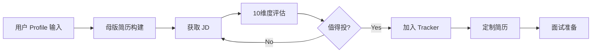

<div align="center">

# 💼 Career Ops Copilot

#### 一个 VS Code Copilot Skill，帮你评估JD、管理投递进度、定制简历、准备面试


[为什么做这个](#-为什么做这个) · [它能做什么](#-它能做什么) · [快速开始](#-快速开始) · [Workflow](#-workflow-overview)

中文 · [English](README.en.md)

</div>

---

## 🤔 为什么做这个

本项目inspired by [career-ops](https://github.com/santifer/career-ops)，适配 **VS Code + GitHub Copilot** 生态，并针对国内求职场景做了以下扩展：

- **Copilot 原生适配** — SKILL.md 格式、触发词、工具调用遵循 Copilot 规范
- **10 维度 JD 评估** — 角色匹配、技能覆盖、成长空间、薪资、WLB 等维度独立打分，辅助投递决策
- **面试材料生成** — STAR 素材结构化 + HTML 面试手册（公司背景、高频问题、反问清单）
- **多用户隔离** — `users/<name>/` 独立工作区，个人数据 gitignore，Skill 可公开共享
- **简历定制不造假** — 仅重排、强调、精简，不添加虚构经历
- **国内平台适配** — 支持 Boss直聘、猎聘等 SPA 页面抓取

## 📋 它能做什么

| 功能 | 触发语 | 说明 |
|------|--------|------|
| 评估 JD | `评估这个JD：[文本]` | 10 维度打分 + 综合评分 + Gap 分析 |
| 管理 Tracker | `加入tracker` | CSV 格式职位追踪，自增 ID，状态管理 |
| 定制简历 | `定制简历，针对#6 XX公司` | 基于原始简历生成定制版，严格不添加虚构内容 |
| 面试准备 | `帮我整理这段经历为STAR格式` | 零散经历 → 标准 STAR 结构，可生成面试手册 |
| 抓取 JD | `抓取这个链接：[URL]` | 自动抓取招聘页面内容（支持 SPA 页面） |

## 🚀 快速开始

**1. Clone 到 Copilot skills 目录**

```bash
# Windows
git clone https://github.com/<your-username>/career-ops-copilot.git "%USERPROFILE%\.copilot\skills\career-ops-copilot"

# macOS / Linux
git clone https://github.com/<your-username>/career-ops-copilot.git ~/.copilot/skills/career-ops-copilot
```

**2. 初始化工作区**

在 Copilot Chat 里输入 `初始化求职工作区`，按提示填入简历内容。

**3. 验证**

输入 `评估这个JD：[粘贴任意JD]`，看到 10 维度评分表格就说明装好了。

> 💡 部分招聘网站（如 Boss 直聘）需要 Playwright 才能抓取，`pip install playwright && playwright install chromium`。详见 [references/spa-scraping-notes.md](references/spa-scraping-notes.md)。

## ⚙️ Workflow Overview



> 💡 母版简历是一个持续积累的过程——每次面试复盘、新项目经历都可以补充进去。

## 📄 输出示例

<details>
<summary><b>母版简历</b></summary>

```markdown
# 张三 | 高级产品经理

## 基本信息
- 电话：138-xxxx-xxxx | 邮箱：zhangsan@email.com
- 坐标：北京 | 期望薪资：80-100w

## 求职意向
AI产品总监 / AI平台产品负责人

## 职业摘要
6年产品经验，专注AI/数据中台方向，擅长从0-1搭建产品并规模化落地。

## 核心技能
- 产品规划与路线图制定
- LLM/NLP 应用落地
- 跨部门协作与团队管理（8人）
- A/B 实验体系搭建
- 数据驱动决策

## 工作经历

### 高级产品经理 | ABC科技 | 2022.03 - 至今
- 负责 AI 中台产品从 0-1 搭建，DAU 从 0 增长至 5万
- 管理 8 人产品团队，主导跨部门协作
- 推动 LLM 落地，上线智能客服模块，人工介入率降低 40%

### 产品经理 | DEF互联网 | 2019.06 - 2022.02
- 负责电商搜索推荐模块，GMV 提升 15%
- 设计 A/B 实验平台，支撑 200+ 实验并行

## 教育背景
- 硕士 | XX大学 计算机科学 | 2017-2019
- 学士 | XX大学 软件工程 | 2013-2017

## 项目亮点 / STAR 素材库
（详见 interview_stories.md）

## 证书 & 其他
- PMP 认证
- 英语 流利（雅思7.5）
```

</details>

<details>
<summary><b>10维度评估表</b></summary>

```markdown
## 评估：ABC科技 AI产品总监（北京）

| 维度 | 分数 | 说明 |
|------|------|------|
| 角色匹配 | 4.5 | 当前岗位自然升级路径 |
| 技能覆盖 | 4.0 | LLM落地经验高度匹配，缺商业化P&L |
| 经验年限 | 4.0 | 要求5年+，实际6年 |
| 行业契合 | 3.5 | AI方向一致，但to B → to C有跨度 |
| 成长空间 | 4.5 | 汇报VP，有团队扩张计划 |
| 薪资范围 | 4.0 | 80-120w，符合预期 |
| 公司规模 | 3.5 | B轮，有不确定性 |
| 地理位置 | 5.0 | 本地 |
| 文化匹配 | 4.0 | 扁平、技术驱动 |
| 竞争难度 | 3.0 | 岗位已开放3周，竞争激烈 |

**综合评分：4.05 / 5.0**

**关键Gap**: 缺乏P&L独立负责经验
**差异化亮点**: LLM落地实战 + A/B实验平台搭建
```

</details>

<details>
<summary><b>面试准备材料</b></summary>

```markdown
# 面试准备：ABC科技 AI产品总监

## 公司背景
- ABC科技，B轮，AI SaaS 赛道，2023年融资2亿
- 核心产品：企业级AI中台，服务金融/零售行业
- 团队规模：~200人，产品团队20人

## 岗位关键信息
- 汇报对象：产品VP
- 团队：直管5人，虚线8人
- 核心KPI：AI模块商业化收入、客户续费率

## STAR 素材（按JD要求匹配）

### 素材1：推动LLM智能客服上线（匹配"AI落地经验"）
**S**: 客服团队30人，日均2000+工单，人力成本高
**T**: Q3上线智能客服，降低人工介入率
**A**: 调研供应商 → 混合方案设计 → 三方对齐 → 灰度放量
**R**: 人工介入率72%→40%，月省45万

### 素材2：搭建A/B实验平台（匹配"数据驱动"）
**S**: 各团队实验流程混乱，结果不可信
**T**: 搭建统一实验平台
**A**: 定义指标体系 → 开发分流引擎 → 建立评审机制
**R**: 支撑200+并行实验，决策效率提升60%

## 高频问题准备
- Q: 你如何推动一个跨部门项目？
- Q: 描述一次产品决策失误及复盘
- Q: 如何衡量AI产品的ROI？

## 反问清单
- 这个岗位未来6个月最重要的3件事是什么？
- 团队目前的技术债/组织债是什么？
- 汇报线和决策流程是怎样的？
- AI模块目前的商业化阶段？
```

</details>

## 🌟 References & Credits

- [career-ops](https://github.com/santifer/career-ops) — 项目灵感来源
- [Playwright](https://playwright.dev/) — SPA 页面抓取
- [955.WLB](https://github.com/formulahendry/955.WLB) / [996.ICU](https://github.com/996icu/996.ICU) — WLB 参考数据
